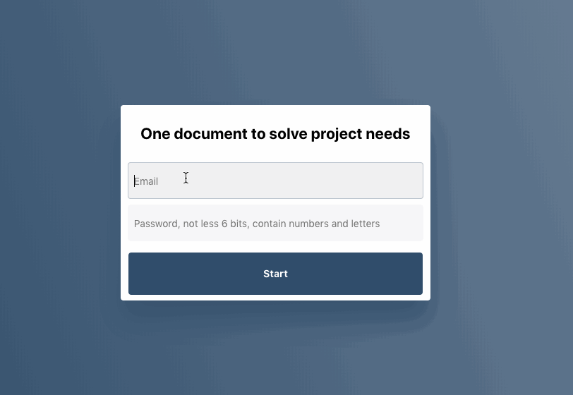

# react-dom-pseudo



## [Englist Document](README-EN.md)

CSS in JS 很棒, 但是如何方便的处理伪类(Pseudo-classes)? **react-dom-pseudo** 提供一个类似 `react-motion` 方式的组件，方便的为 `react-dom` 对象提供类似 CSS 的伪类.

我们首先用 `npm` 安装：

```sh
$ npm install --save react-dom-pseudo
```

## APIs

**react-dom-pseudo** 支持以下伪类：

| Props        | 模拟伪类 | 说明                                        | 默认值    | 必须 |
| ------------ | -------- | ------------------------------------------- | --------- | ---- |
| merge        |          | 是否使用 style 和 其他状态的 style 进行合并 | true      | 否   |
| disable      |          | 是否取消事件监听                            | false     | 否   |
| style        |          | 默认样式                                    | undefined | 否   |
| linkStyle    | :link    | 未被点击之前的样式                          | undefined | 否   |
| visitedStyle | :visited | 被点击过的样式                              | undefined | 否   |
| focusStyle   | :focus   | input 等类型元素 onFocus 时的样式           | undefined | 否   |
| hoverStyle   | :hover   | 鼠标移入时显示的样式                        | undefined | 否   |
| activeStyle  | :active  | 鼠标或者触屏点击时的样式                    | undefined | 否   |
| disableStyle |          | 当取消事件监听时的样式                      | undefined | 否   |
| alwayStyle   |          | 会和所有样式合并，并且覆盖重复的样式属性    | undefined | 否   |

他们会根据事件的触发，和 `style` 合并返回， 如 `{...style, ...activeStyle}`, 只有存在的样式会进行合并

样式的组合规则: `{...style, ...linkStyle, ...eventStyle, ...disableStyle, ...alwayStyle}`

## 使用

```js
import Pseudo from 'react-dom-pseudo';

export default () => {
  return (
    <div>
      <div>example:</div>
      <Pseudo
        style={sheet.input}
        hoverStyle={sheet.inputHover}
        focusStyle={sheet.inputFocus}
      >
        {events => <input {...events} />}
      </Pseudo>
    </div>
  );
};

// CSS in js
const sheet = {
  input: {
    fontSize: '14px',
    border: '1px solid rgba(0,0,0,0)',
    background: '#f3f3f3',
    // 启用过渡动画
    transition: 'all 0.2s ease-out',
  },
  inputHover: {
    background: '#f0f0f0',
  },
  inputFocus: {
    border: '1px solid rgba(0,0,0,0.1)',
    background: '#f0f0f3',
    transitionTimingFunction: 'ease-in',
  },
};
```

## 其中做了什么？

Pseudo 的 renderProps 中包含以下事件

- onClick: 用来模拟 :link 和 :visited 伪类
- onFocus\Blur: 用来模拟 :focus 伪类
- onMouseEnter\Leave: 用来模拟 :hover 伪类
- onMouseDown\Up: 用来模拟 :active 伪类

如果项目在移动端执行，就会把 `onMouse?` 相关的事件替换成 `onTouch?` 以兼容移动端

## renderProps 的方式相比我直接定义一个 `Input` 组件有什么优势？

我们先看看如果我们直接定义一个 Input 组件，来模拟 :hover 伪类

```js
// 以下代码直接在 markdown 中编写，并无经过运行，仅用于阐述观点
class Input extend React.Component {
  state = {
    hover: false
  }
  handleMouseEnter = ()=>{
    this.setState({ hover: true });
  }
  handleMouseLeave = ()=>{
    this.setState({ hover: false });
  }
  render(){
    return <input style={this.state.hover?{...this.props.style, ...this.props.hoverStyle}:this.props.style} onMouseEnter={this.handleMouseEnter} onMouseLeave={this.handleMouseLeave} />
  }
}
```

然后我们在项目中使用：

```js
<Input style={inputStyle} hover={inputHoverStyle} />
```

一切看起来不错，但是它**不利于扩展**， 例如：我们如果需要给一个 `div` 或 `SignButton` 也添加以上功能，我们需要再写一个以上组件


当然，我们也可以使用 HOC 的方式, 编写一个 `withHover` 的组件, 即便如此，也需要在使用之前创建一个新的组件:

```js
const SignButton = withHover(SignButton);
```

对比之下，就没有 `RenderProps` 的方式优雅:

```js
<Pseudo style={inputStyle} hoverStyle={inputHoverStyle}>
  {events => <input {...events} />}
</Pseudo>
<Pseudo style={inputStyle} hoverStyle={inputHoverStyle}>
  {events => <div {...events} />}
</Pseudo>
<Pseudo style={inputStyle} hoverStyle={inputHoverStyle}>
  {events => <SignButton {...events} />}
</Pseudo>
```

## `react-dom-pseudo` 还可以更简化么？

由于如果子对象是一个 `div` 或是一个 `数组` 时，觉得使用 `childrenFuncion` 的意义不大，所以可以把简写：

```js
// 可以简写成如下， 此时 Pseudo 是一个 div组件
<Pseudo style={inputStyle} hoverStyle={inputHoverStyle} />

// 同理，多个子元素，也可以这样
<Pseudo style={inputStyle} hoverStyle={inputHoverStyle}>
  <p>多个子元素</p>
  
  <div>父级相当于一个div</div>
</Pseudo>
```

## 我如何获取 hover、active 等状态，做除了样式之外的其他事件？

renderProps 的参数还有第二个，是 `Pseudo` 内部的 `state`, 我们可以获取它之后做其他事件, 如下面的例子，根据 hover 的状态我们修改 `div` 的 `innerText`,

state 有 4 个对象 `{ hover, focus, active, visited }`

```js
<Pseudo style={inputStyle} hoverStyle={inputHoverStyle}>
  {(events, state) => {
    const mouseState = state.hover ? 'mouseIn' : 'mouseOut';
    return <div {...events}>{mouseState}</div>;
  }}
</Pseudo>
```

## 如何临时屏蔽事件监听?

Pseudo 把 `disable` 设置成 `true`

```js
<Pseudo disable />
```

## 如何在所有状态样式的外层添加样式?

Pseudo 有一个 `alwayStyle` 属性，最终返回的样式是这样的 `{...style, ...otherStyle, ...alwayStyle}`

```js
<Pseudo alwayStyle={style} />
```

## CSS in JS 好用么？

因人而异，我觉得比写 `css` 和 `sass` 更好一些，其原因有以下几点：

1. 许多动画库，如 `react-motion`, `react-spring` 等，都会需要操作 style 对象, 它的样式可能分别会存在 css 和 js 中，此时就没有 CSS in JS 简洁;
2. CSS in JS 可以让组件相关的代码在一个文件里闭合，我们修改一个组件时，不需要来回切换文件;
3. 如果我们项目较大，需要切分模块，CSS in JS 会比传统的 css 文件更好和组件一起切分做懒加载.

如何解决一些 CSS in JS 写起来麻烦的事情？

1. `sass` 的颜色混合等功能，可以使用 [`mix-color`](https://github.com/ymzuiku/mix-color) 之类的库轻松解决；
2. `sass` 的自定义变量，在 CSS in JS 中可以很轻松的定义一个 `globalStyles` 对象达到；
3. css 的伪类，以前用组件 state 的写法编写起来比较麻烦、重复，可以用 `react-dom-pseudo` 解决.

## `react-dom-pseudo` 支持 `react-native` 吗？

由于 `react-dom-pseudo` 用到了 `ReactDOM` 的事件，所以不支持 `react-native`, 或许有时间会补充一个 `react-native-pseudo`

## License

```
MIT License

Copyright (c) 2013-present, Facebook, Inc.

Permission is hereby granted, free of charge, to any person obtaining a copy
of this software and associated documentation files (the "Software"), to deal
in the Software without restriction, including without limitation the rights
to use, copy, modify, merge, publish, distribute, sublicense, and/or sell
copies of the Software, and to permit persons to whom the Software is
furnished to do so, subject to the following conditions:

The above copyright notice and this permission notice shall be included in all
copies or substantial portions of the Software.

THE SOFTWARE IS PROVIDED "AS IS", WITHOUT WARRANTY OF ANY KIND, EXPRESS OR
IMPLIED, INCLUDING BUT NOT LIMITED TO THE WARRANTIES OF MERCHANTABILITY,
FITNESS FOR A PARTICULAR PURPOSE AND NONINFRINGEMENT. IN NO EVENT SHALL THE
AUTHORS OR COPYRIGHT HOLDERS BE LIABLE FOR ANY CLAIM, DAMAGES OR OTHER
LIABILITY, WHETHER IN AN ACTION OF CONTRACT, TORT OR OTHERWISE, ARISING FROM,
OUT OF OR IN CONNECTION WITH THE SOFTWARE OR THE USE OR OTHER DEALINGS IN THE
SOFTWARE.
```
